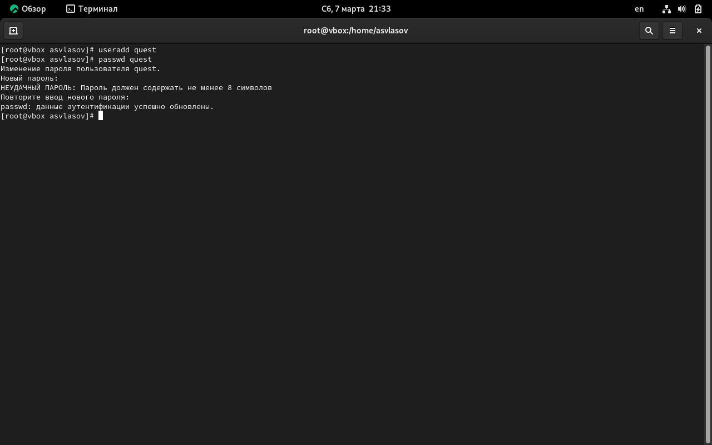
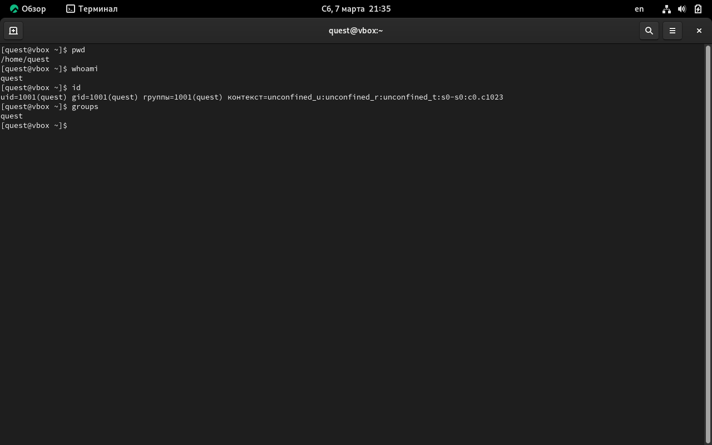
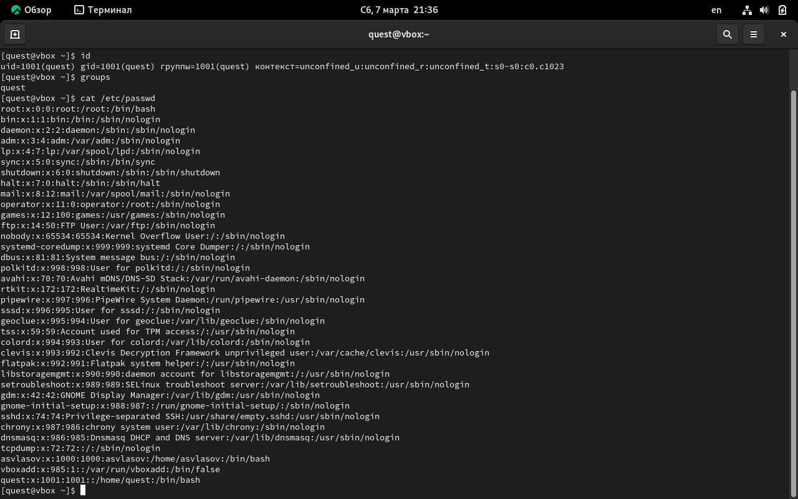
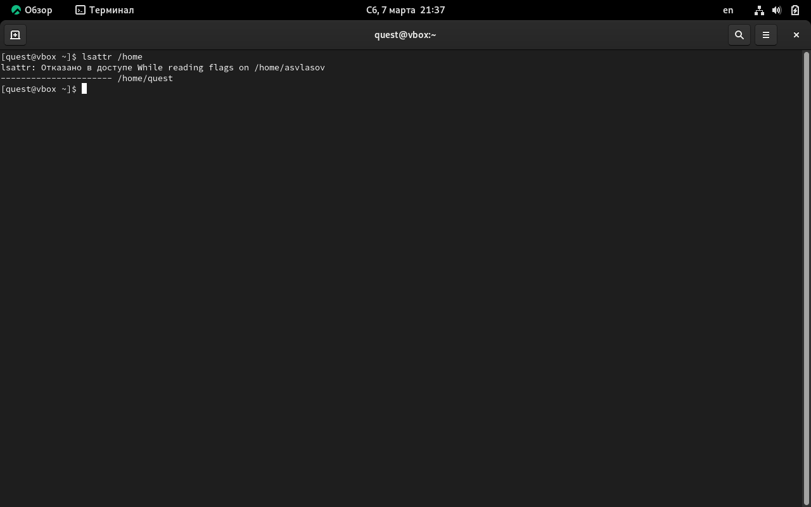
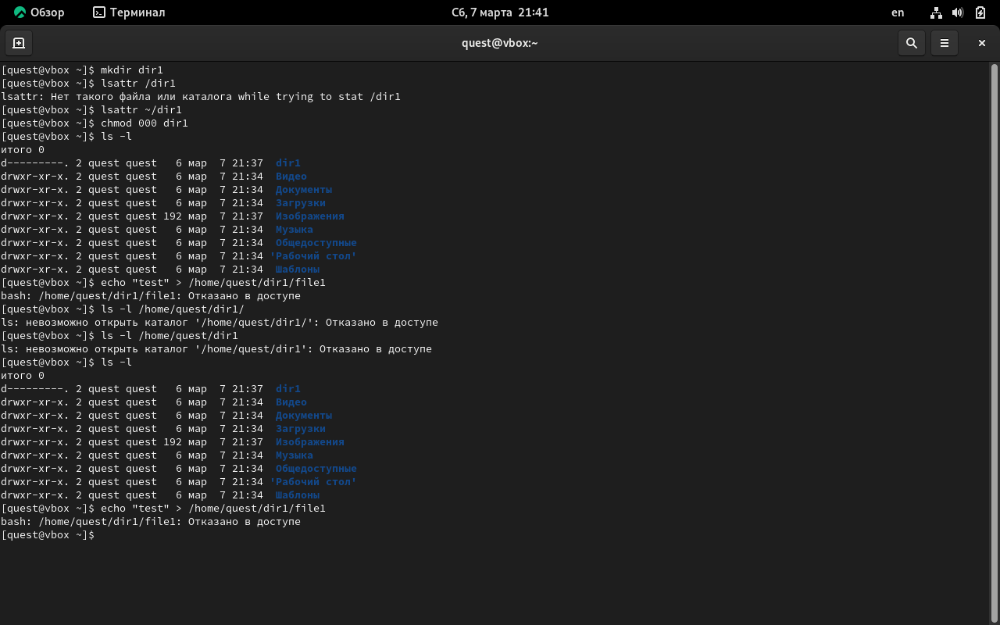

---
## Author
author:
  name: Власов Артем Сергеевич
  degrees: DSc
  orcid: 0000-0002-0877-7063
  email: 11322469841@rudn.ru
  affiliation:
    - name: Российский университет дружбы народов
      country: Российская Федерация
      postal-code: 117198
      city: Москва
      address: ул. Миклухо-Маклая, д. 6

## Title
title: "Отчет по лабораторной работе 2"
subtitle: "Власов Артем Сергеевич"
license: "CC BY"
---

# Цель работы

Получение практических навыков работы в консоли с атрибутами файлов, закрепление теоретических основ дискреционного разграничения доступа в современных системах с открытым кодом на базе ОС Linux.

# Задание

Выполнить задания с другим пользователем.

# Выполнение лабораторной работы

### 1. Создание учётной записи guest

{#fig-001 width=70%}
 
### 2. Определение текущей директории

{#fig-002 width=70%}
- Команда pwd показала: /home/guest
- Приглашение командной строки имело вид: guest@hostname:~$
- Команда whoami подтвердила, что текущим пользователем является guest
- Команда id:
  uid=1001(guest) gid=1001(guest) groups=1001(guest)
- Команда groups:
  guest
**Сравнение:** Вывод команды groups содержит только основную группу пользователя, в то время как id показывает более детальную информацию: uid, gid и полный список групп.

Приглашение командной строки имеет вид: guest@hostname:~$. Имя пользователя в приглашении (guest) полностью совпадает с данными, полученными от команд whoami и id.
 
### 3. Просмотр файла /etc/passwd

{#fig-003 width=70%}
 
Результат поиска:
guest:x:1001:1001:,,,:/home/guest:/bin/bash
 
**Сравнение:**
- Найденный UID: 1001 (совпадает с выводом id)
- Найденный GID: 1001 (совпадает с выводом id и groups)
- Домашняя директория: /home/guest (совпадает с pwd)
- Интерпретатор: /bin/bash

### 4. Просмотр содержимого /home/

{#fig-004 width=70%}

Команда:
ls -l /home/

**Вывод:** Список поддиректорий директории /home получить удалось, так как на директории /home для владельца root и группы root установлены права чтения и исполнения для всех остальных (r-x). На поддиректориях установлены права:

Команда:
lsattr /home

 
**Вывод:** Удалось увидеть расширенные атрибуты директорий. Расширенные атрибуты у директорий других пользователей также видны, но изменять их можно только при наличии соответствующих прав. В данном случае все атрибуты сброшены (не установлены).
 

 
### 5. Создание поддиректории dir1

{#fig-005 width=70%}

**Вывод:** При создании директории по умолчанию устанавливаются права drwxr-xr-x (755) и расширенные атрибуты отсутствуют.
Права на директорию dir1 успешно изменены на 000 (отсутствие любых прав для владельца, группы и остальных пользователей).
 Отказ в выполнении операции по созданию файла получен, потому что на директории dir1 установлены права 000. Для создания файла в директории необходимо иметь право на запись (w) в эту директорию. Так как все права сняты, операция невозможна даже для владельца.
 

## Таблица 2.1 - Права доступа при различных атрибутах
 
| Операция | Смена атрибутов файла | Просмотр файлов в директории | Удаление файла | Правка файла (000) | Правка директории (100) | Правка файла (000) | Правка директории (100) |
|----------|:---------------------:|:----------------------------:|:--------------:|:------------------:|:-----------------------:|:------------------:|:-----------------------:|
| Информационная безопасность компьютерных сетей | + | + | + | - | - | - | - |
| Информационная безопасность программного обеспечения | + | + | + | - | - | - | + |
| Удаление файла | + | + | + | - | - | - | - |
| Создание и удаление файла | + | + | + | - | - | - | - |
| Удаление файла | + | + | + | - | -0 | - | - |
| Создание директории | + | + | + | - | - | - | - |
 
## Таблица 2.2 - Минимальные права для совершения операций
 
| Операция | Минимальные права на директорию | Минимальные права на файл |
|----------|--------------------------------|---------------------------|
| Создание файла | `wx` (запись и исполнение) | - |
| Удаление файла | `wx` (запись и исполнение) | - |
| Чтение файла | `x` (исполнение) | `r` (чтение) |
| Запись в файл | `x` (исполнение) | `w` (запись) |
| Переименование файла | `wx` (запись и исполнение) | - |
| Создание поддиректории | `wx` (запись и исполнение) | - |
| Удаление поддиректории | `wx` (запись и исполнение) | - |

# Выводы

Мы получили практические навыки работы в консоли с атрибутами файлов, закрепление теоретических основ дискреционного разграничения доступа в современных системах с открытым кодом на базе ОС Linux.

# Список литературы{.unnumbered}

::: {#refs}
:::
