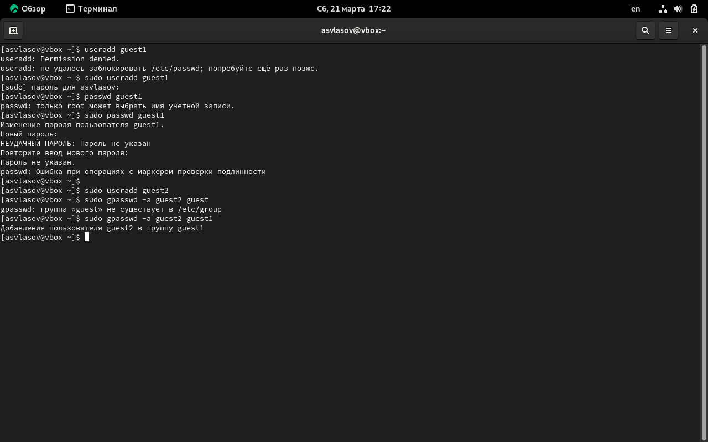
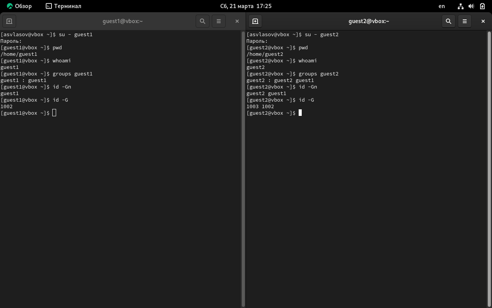
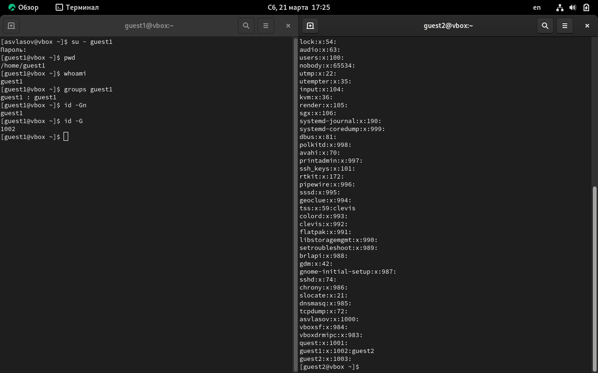
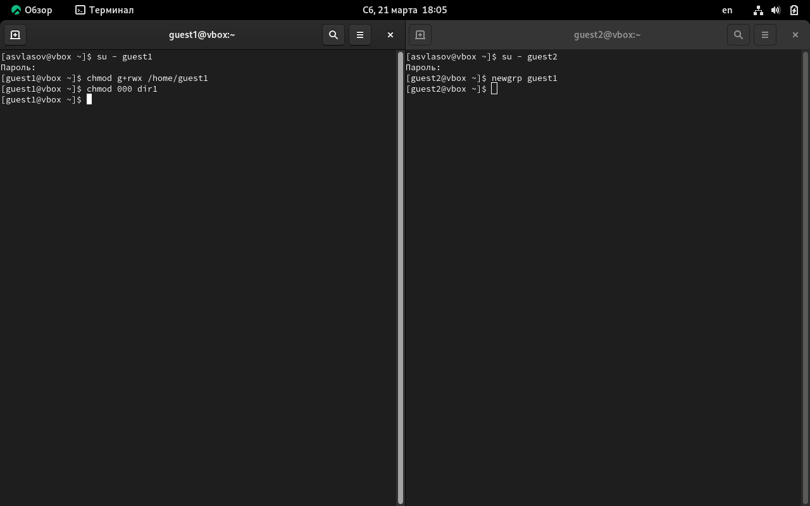

---
## Author
author:
  name: Власов Артем Сергеевич
  degrees: DSc
  orcid: 0000-0002-0877-7063
  email: 11322469841@rudn.ru
  affiliation:
    - name: Российский университет дружбы народов
      country: Российская Федерация
      postal-code: 117198
      city: Москва
      address: ул. Миклухо-Маклая, д. 6

## Title
title: "Отчет по лабораторной работе 3"
subtitle: "Власов Артем Сергеевич"
license: "CC BY"
---

# Цель работы

Получение практических навыков работы в консоли с атрибутами файлов, закрепление теоретических основ дискреционного разграничения доступа в современных системах с открытым кодом на базе ОС Linux.

# Задание

Выполнить задания с двумя новыми пользователями.

# Выполнение лабораторной работы

### 1. Создание учётных записей.

{#fig-001 width=70%}
 
### 2. Сравнение групп двух пользователей

{#fig-002 width=70%}

### 3. Просмотр файла /etc/group

{#fig-003 width=70%}
 
### 4. Установка прав доступа для пользователя 2, используя пользователя 1.

{#fig-004 width=70%}

## Таблица 1
 
| Операция | Смена атрибутов файла | Просмотр файлов в директории | Удаление файла | Правка файла (000) | Правка директории (100) | Правка файла (000) | Правка директории (100) |
|----------|:---------------------:|:----------------------------:|:--------------:|:------------------:|:-----------------------:|:------------------:|:-----------------------:|
| Информационная безопасность компьютерных сетей | + | + | + | - | - | - | - |
| Информационная безопасность программного обеспечения | + | + | + | - | - | - | + |
| Удаление файла | + | + | + | - | - | - | - |
| Создание и удаление файла | + | + | + | - | - | - | - |
| Удаление файла | + | + | + | - | -0 | - | - |
| Создание директории | + | + | + | - | - | - | - |
 
## Таблица 2
 
| Операция | Минимальные права на директорию | Минимальные права на файл |
|----------|--------------------------------|---------------------------|
| Создание файла | `wx` (запись и исполнение) | - |
| Удаление файла | `wx` (запись и исполнение) | - |
| Чтение файла | `x` (исполнение) | `r` (чтение) |
| Запись в файл | `x` (исполнение) | `w` (запись) |
| Переименование файла | `wx` (запись и исполнение) | - |
| Создание поддиректории | `wx` (запись и исполнение) | - |
| Удаление поддиректории | `wx` (запись и исполнение) | - |

# Выводы

Мы получили практические навыки работы в консоли с атрибутами файлов, закрепление теоретических основ дискреционного разграничения доступа в современных системах с открытым кодом на базе ОС Linux.

# Список литературы{.unnumbered}

::: {#refs}
:::
