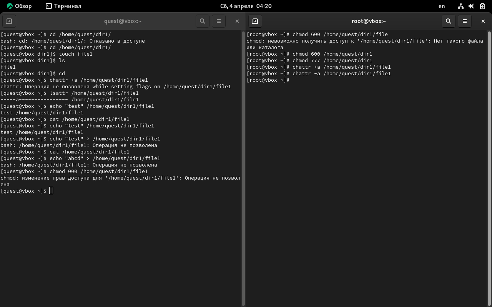
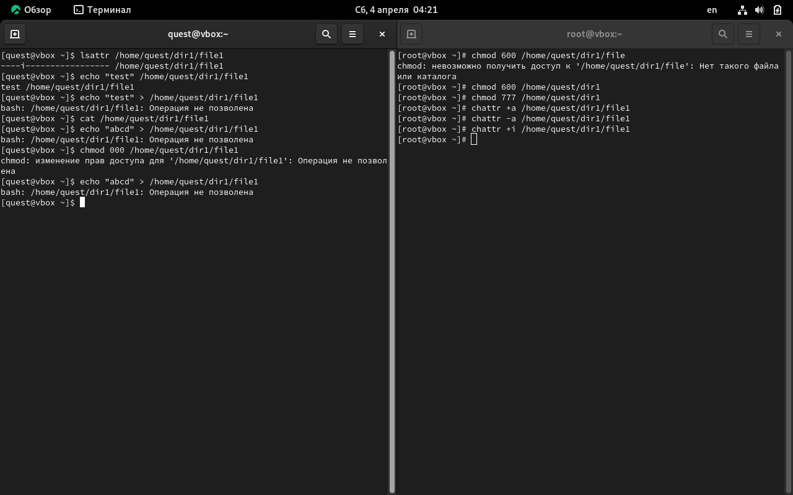

---
## Author
author:
  name: Власов Артем Сергеевич
  degrees: DSc
  orcid: 0000-0002-0877-7063
  email: 11322469841@rudn.ru
  affiliation:
    - name: Российский университет дружбы народов
      country: Российская Федерация
      postal-code: 117198
      city: Москва
      address: ул. Миклухо-Маклая, д. 6

## Title
title: "Отчет по лабораторной работе 4"
subtitle: "Власов Артем Сергеевич"
license: "CC BY"
---

# Цель работы

Получение практических навыков работы в консоли с расширенными атрибутами файлов.

# Задание

Выполнить задания с пользователями.

# Выполнение лабораторной работы

### 1. Атрибут +a

Изначальной файл не имеет атрибутов, все действия отказано в доступе. Затем мы добавляем ему права достпуа и атрибут на запись и чтение, теперь мы можем записать в файл, но изменить уже записанное не получается.

{#fig-001 width=70%}

Проводим действия с файлом поппутно проверяя значение атрибутов.
 
### 2. Атрибут +i

Изначальной файл не имеет атрибутов, все действия отказано в доступе. Затем мы добавляем ему права достпуа и атрибут i, теперь мы можем записать в файл и изменить запись с другого пользователя.

{#fig-002 width=70%}

# Выводы

Мы получили практические навыки работы в консоли с расширенными атрибутами файлов.

# Список литературы{.unnumbered}

::: {#refs}
:::
