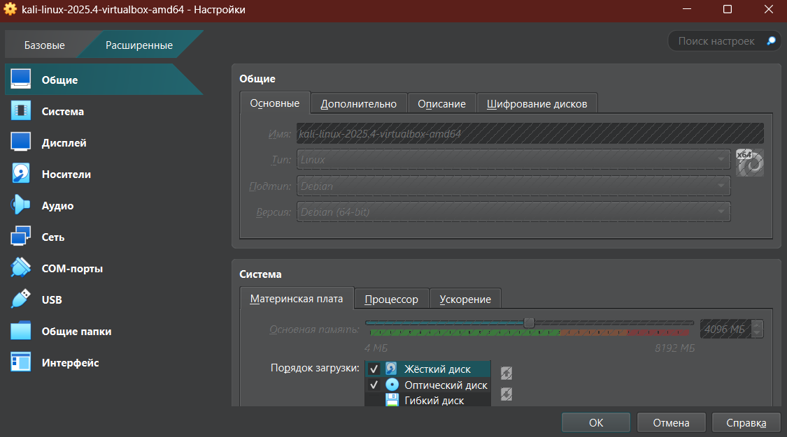
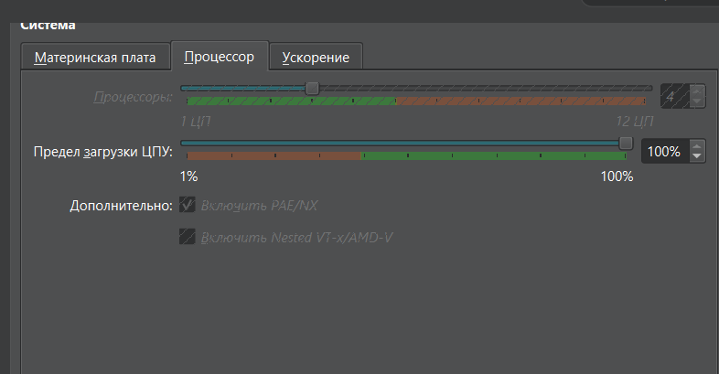
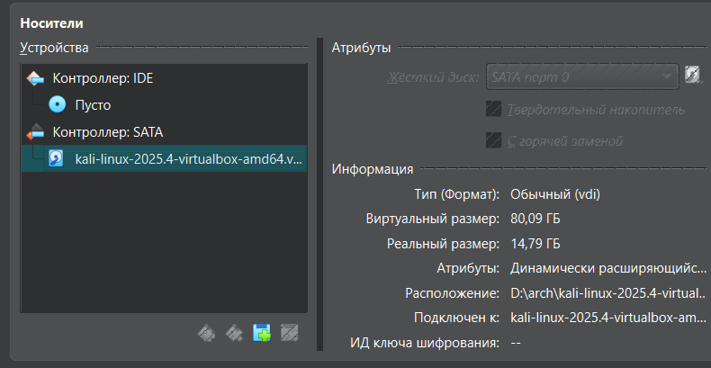

---
## Author
author:
  name: Власов Артем Сергеевич
  degrees: DSc
  orcid: 0000-0002-0877-7063
  email: 1132246841@rudn.ru
  affiliation:
    - name: Российский университет дружбы народов
      country: Российская Федерация
      postal-code: 117198
      city: Москва
      address: ул. Миклухо-Маклая, д. 6

## Title
title: "Индивидуальный проект"
subtitle: "Этап 1"
license: "CC BY"
---

# Цель работы

Установка Kali Linux на виртуальную машину.

# Задание

Установка Kali Linux на виртуальную машину.

# Выполнение работы

## Создаем машину и подключаем образ.

{#fig-001 width=70%}

## Настраиваем параметры оперативной памяти и процессора

{#fig-002 width=70%}

## Настраиваем параметры оперативной памяти и процессора

{#fig-002 width=70%}

## Добавляем жесткий диск

{#fig-003 width=70%}

Запускаем виртуальную машину

# Выводы

Мы установили систему на виртуальную машину.

# Список литературы{.unnumbered}

::: {#refs}
:::
