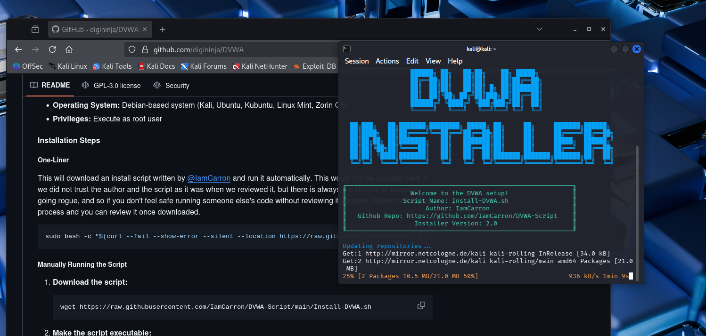
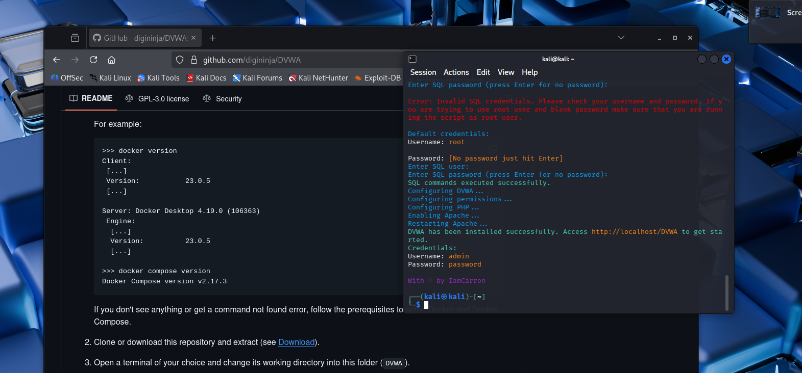

---
## Author
author:
  name: Власов Артем Сергеевич
  degrees: DSc
  orcid: 0000-0002-0877-7063
  email: 1132246841@rudn.ru
  affiliation:
    - name: Российский университет дружбы народов
      country: Российская Федерация
      postal-code: 117198
      city: Москва
      address: ул. Миклухо-Маклая, д. 6
## Title
title: Индивидуальный проект
subtitle: Этап 2
license: CC BY
date: today
date-format: "YYYY-MM-DD" # Example: 2025-09-06
---

# Информация

## Докладчик

:::::::::::::: {.columns align=center}
::: {.column width="70%"}

  * Власов Артем Сергеевич
  * Студент
  * Российский университет дружбы народов им. П. Лумумбы
  * <https://vlasovas52.github.io/ru/>

:::
::: {.column width="30%"}

:::
::::::::::::::

# Вводная часть

## Цели и задачи

Установить DVWM на виртуальную машину.

# Выполнение работы

Устанавливаем из репозитория.

{#fig-001 width=70%}

{#fig-002 width=70%}
 
# Выводы

Мы установили DVWM на вирутальную машину.

